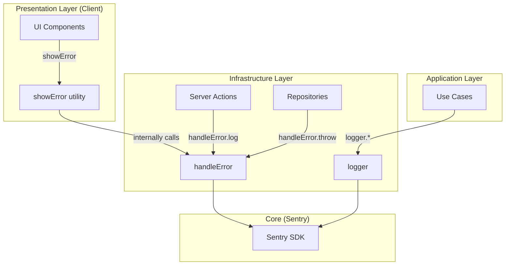

# Logging and Error Handling Guide

## Overview

Nowly uses a unified logging and error handling system built on Sentry that maintains clean architecture boundaries and provides consistent patterns across all layers.

### Key Principles

1. **Separation of Concerns**: Error handlers handle errors (parsing, logging, propagating). UI components handle user feedback (toasts, inline errors).
2. **Layer-Appropriate Patterns**: Different layers use different methods based on their responsibilities.
3. **Structured Logging**: All logs include context objects for better observability.
4. **Cost Optimization**: Smart sampling in production reduces Sentry volume while maintaining observability.

### Architecture Decision: Toast Separation

**Why toasts are NOT in error handlers:**

- ❌ **Old Pattern** `handleError.toast()` - Mixed infrastructure and presentation concerns
- ✅ **New Pattern**: `handleError.log()` + `showError()` - Clean layer separation

**Benefits:**

- Server actions don't have client-side dependencies (server-safe)
- Error handling is testable without UI mocks
- Clean architecture boundaries maintained
- React Query patterns work naturally
- Different UI feedback options (toast, inline, modal) per use case



---

## Quick Start

### Installation

The logging system is already configured. Just import what you need:

```typescript
// In server actions, use cases, repositories
import { logger, handleError } from '@/src/shared/logging';

// In client components (for UI feedback)
import { showError, showSuccess } from '@/src/presentation/utils/error-display';
```

### Basic Usage

```typescript
// Log information
logger.info('Task created', { taskId: task.id, userId: user.id });

// Handle errors in server action
const error = handleError.log(authError);
return { success: false, error: error.message };

// Show error to user (client only)
showError(error, 'Failed to create task');
```

---

## Logger API Reference

The `logger` provides structured logging at different severity levels.

### Log Levels

| Level   | Production Sampling | Use Cases                              | Example                                       |
| ------- | ------------------- | -------------------------------------- | --------------------------------------------- |
| `trace` | 5%                  | Function entry/exit, detailed flow     | `logger.trace('Entering function', { args })` |
| `debug` | 10%                 | Development diagnostics, query details | `logger.debug('Cache hit', { key })`          |
| `info`  | 20%                 | Business events, successful operations | `logger.info('Task created', { taskId })`     |
| `warn`  | 100%                | Recoverable errors, fallback behavior  | `logger.warn('Using fallback', { reason })`   |
| `error` | 100%                | Failures, caught exceptions            | `logger.error('Operation failed', { error })` |
| `fatal` | 100%                | Critical system failures               | `logger.fatal('DB connection lost', {})`      |

### Method Signatures

```typescript
logger.trace(message: string, context?: Record<string, unknown>): void
logger.debug(message: string, context?: Record<string, unknown>): void
logger.info(message: string, context?: Record<string, unknown>): void
logger.warn(message: string, context?: Record<string, unknown>): void
logger.error(message: string, context?: Record<string, unknown>): void
logger.fatal(message: string, context?: Record<string, unknown>): void
```

### Context Objects

Always include relevant context for better debugging:

```typescript
// ✅ Good - structured context
logger.info('Task created', {
  taskId: task.id,
  userId: user.id,
  categoryId: task.categoryId,
  hasRecurrence: !!task.recurringItemId,
});

// ❌ Bad - no context
logger.info('Task created');

// ❌ Bad - sensitive data
logger.info('User authenticated', {
  password: user.password, // NEVER log passwords
  token: session.token, // NEVER log tokens
});
```

---

## Error Handler API Reference

The `handleError` provides different strategies for different layers.

### Methods

#### `handleError.log(error: unknown): AppError`

**Use in:** Server Actions  
**Purpose:** Log error and return to client

```typescript
export async function createTaskAction(formData: FormData) {
  const {
    data: { user },
    error: authError,
  } = await supabase.auth.getUser();

  if (authError || !user) {
    const error = handleError.log(authError);
    return { success: false, error: error.message };
  }

  // Continue with operation...
}
```

**What it does:**

- Parses error into AppError format
- Logs to Sentry at error level
- Logs to logger with context
- Returns AppError for client handling
- Does NOT show toast (UI layer responsibility)

---

#### `handleError.throw(error: unknown): never`

**Use in:** Repositories, Infrastructure Layer  
**Purpose:** Log error and propagate to caller

```typescript
export class SupabaseTaskRepository implements ITaskRepository {
  async create(task: Omit<Task, 'id' | 'createdAt' | 'updatedAt'>): Promise<Task> {
    const { data, error } = await this.client.from('tasks').insert(...);

    if (error) {
      handleError.throw(error);
    }

    if (!data) {
      handleError.throw(new Error('No data returned after insert'));
    }

    return this.toDomain(data);
  }
}
```

**What it does:**

- Parses error into AppError format
- Logs to Sentry at error level
- Logs to logger with context
- Throws AppError to be caught by caller
- Never returns (throws immediately)

---

#### `handleError.silent(error: unknown): AppError`

**Use in:** Non-critical operations, optional features  
**Purpose:** Track errors without blocking execution

```typescript
export async function getTasksByWeekAction(date: Date) {
  // ...auth and setup...

  // Ensure recurring tasks are generated (non-critical)
  const generationResponse = await ensureTasksGenerated(...);

  if (!generationResponse.success) {
    // Log but don't block - tasks will generate later
    handleError.silent(generationResponse.error);
  }

  // Continue fetching tasks regardless
  const response = await listTasksByWeek(...);
  return response;
}
```

**What it does:**

- Parses error into AppError format
- Logs to Sentry at **warning** level (not error)
- Logs to logger at warn level
- Returns AppError without throwing
- Use for degraded functionality scenarios

---

#### `handleError.validation(message: string, details?: unknown): void`

**Use in:** Server Actions, Form validation  
**Purpose:** Track validation failures without noise

```typescript
export async function createTaskAction(formData: FormData) {
  const result = createTaskSchema.safeParse(data);

  if (!result.success) {
    handleError.validation('Create task validation failed', result.error);
    return {
      success: false,
      errors: result.error.flatten().fieldErrors,
    };
  }

  // Continue with valid data...
}
```

**What it does:**

- Logs to logger at **info** level (not error)
- Does NOT log to Sentry as exception
- Reduces Sentry noise from expected user errors
- Still tracked for pattern analysis

**Why info level?** Validation errors are expected user behavior (bad input), not system failures.

---

## UI Feedback API Reference

The `showError` and `showSuccess` utilities provide client-side user feedback.

### Methods

#### `showError(error: unknown, customMessage?: string): AppError`

**Use in:** Client Components, React Query hooks  
**Purpose:** Display error to user with toast

```typescript
// In React Query mutation
export function useCreateTask() {
  return useMutation({
    mutationFn: createTaskAction,
    onError: (error) => {
      showError(error, 'Failed to create task');
    },
  });
}

// In component event handler
async function handleSubmit() {
  const result = await createTaskAction(formData);

  if (!result.success) {
    showError(result.error, 'Failed to create task');
  }
}
```

---

#### `showSuccess(message: string): void`

**Use in:** Client Components  
**Purpose:** Display success feedback

```typescript
export function useDeleteTask() {
  return useMutation({
    mutationFn: deleteTaskAction,
    onSuccess: () => {
      showSuccess('Task deleted successfully');
      queryClient.invalidateQueries({ queryKey: taskKeys.all });
    },
  });
}
```

---

#### `showInfo(message: string): void` / `showWarning(message: string): void`

Additional toast utilities for informational and warning messages.

```typescript
showInfo('Your changes have been saved');
showWarning('Some tasks could not be synced');
```

---

## Layer-Specific Guidelines

### Server Actions (`app/actions/`)

**What to use:**

- ✅ `logger.error()` for operation failures
- ✅ `logger.info()` for successful operations (sparingly)
- ✅ `handleError.log()` for errors to return to client
- ✅ `handleError.validation()` for Zod validation failures
- ✅ `handleError.silent()` for non-critical failures

**What NOT to use:**

- ❌ `showError()` - Client-side only
- ❌ `handleError.throw()` - Return structured results instead

**Pattern:**

```typescript
export async function createTaskAction(formData: FormData) {
  const supabase = await createClient();

  // 1. Validate input
  const result = createTaskSchema.safeParse(data);
  if (!result.success) {
    handleError.validation('Create task validation failed', result.error);
    return { success: false, errors: result.error.flatten().fieldErrors };
  }

  // 2. Check authentication
  const {
    data: { user },
    error: authError,
  } = await supabase.auth.getUser();
  if (authError || !user) {
    const error = handleError.log(authError);
    return { success: false, error: error.message };
  }

  // 3. Execute use case
  const repository = new SupabaseTaskRepository(supabase);
  const response = await createTask(result.data, user.id, repository);

  if (!response.success) {
    const error = handleError.silent(response.error);
    return { success: false, error: error.message };
  }

  // 4. Log success
  logger.info('Task created successfully', { taskId: response.task.id });

  return { success: true, task: response.task };
}
```

---

### Use Cases (`src/application/`)

**What to use:**

- ✅ `logger.debug()` for operation details
- ✅ `logger.info()` for significant business events
- ✅ `logger.warn()` for edge cases or fallback behavior
- ✅ `logger.error()` in try-catch blocks
- ✅ Return error objects `{ success: false, error: string }`

**What NOT to use:**

- ❌ `handleError.*` methods - Too much coupling to infrastructure
- ❌ `showError()` - Wrong layer
- ❌ Throwing errors - Return error objects instead

**Pattern:**

```typescript
export async function createTask(
  input: CreateTaskInput,
  userId: string,
  repository: ITaskRepository
): Promise<MutateTaskResponse> {
  try {
    logger.debug('Creating task', { userId, title: input.title });

    // Generate position
    const position = await generatePositionForNewTask(
      userId,
      input.scheduledDate,
      repository
    );

    // Create task
    const task = await repository.create({
      ...input,
      userId,
      position,
      completed: false,
    });

    logger.info('Task created', { taskId: task.id, userId });

    return { success: true, task };
  } catch (error) {
    logger.error('Create task failed', { error, userId });
    return {
      success: false,
      error: error instanceof Error ? error.message : 'Failed to create task',
    };
  }
}
```

---

### Repositories (`src/infrastructure/repositories/`)

**What to use:**

- ✅ `handleError.throw()` for database errors
- ✅ `logger.debug()` for query details (sparingly)
- ✅ `logger.warn()` for empty results or edge cases

**What NOT to use:**

- ❌ `handleError.log()` - Wrong layer (use throw)
- ❌ `handleError.silent()` - Wrong layer (use throw)
- ❌ `showError()` - Wrong layer

**Pattern:**

```typescript
export class SupabaseTaskRepository implements ITaskRepository {
  constructor(private client: SupabaseClient<Database>) {}

  async create(
    task: Omit<Task, 'id' | 'createdAt' | 'updatedAt'>
  ): Promise<Task> {
    logger.debug('Creating task in database', { userId: task.userId });

    const { data, error } = await this.client
      .from('tasks')
      .insert(this.toDatabase(task))
      .select()
      .single();

    if (error) {
      handleError.throw(error);
    }

    if (!data) {
      handleError.throw(new Error('No data returned after insert'));
    }

    return this.toDomain(data);
  }

  async findByUserId(userId: string): Promise<Task[]> {
    logger.debug('Finding tasks by user', { userId });

    const { data, error } = await this.client
      .from('tasks')
      .select('*')
      .eq('user_id', userId);

    if (error) {
      handleError.throw(error);
    }

    if (!data || data.length === 0) {
      logger.warn('No tasks found for user', { userId });
      return [];
    }

    return data.map((row) => this.toDomain(row));
  }
}
```

---

### Client Components (`src/presentation/`)

**What to use:**

- ✅ `showError()` for user-facing errors (toasts)
- ✅ `showSuccess()` for success messages
- ✅ React Query `onError` callback for mutations
- ✅ `logger.debug()` for UI interactions (sparingly - performance)

**What NOT to use:**

- ❌ `handleError.throw()` - Wrong layer
- ❌ `handleError.log()` in components - Use showError instead
- ❌ Excessive logging - Client performance impact

**Pattern:**

```typescript
// React Query Hook
export function useCreateTask() {
  const queryClient = useQueryClient();

  return useMutation({
    mutationFn: createTaskAction,
    onError: (error) => {
      showError(error, 'Failed to create task');
    },
    onSuccess: (data) => {
      showSuccess('Task created successfully!');
      queryClient.invalidateQueries({ queryKey: taskKeys.all });
    },
  });
}

// Component usage
export function TaskForm() {
  const createTask = useCreateTask();

  const onSubmit = async (data: TaskFormData) => {
    createTask.mutate(data);
  };

  return (
    <form onSubmit={handleSubmit(onSubmit)}>
      {/* form fields */}
    </form>
  );
}
```

---

## Best Practices

### Context Object Structure

**Always include:**

- Relevant IDs (userId, taskId, categoryId, etc.)
- Operation type or name
- Key parameters or inputs

**Never include:**

- Passwords or tokens
- Full user objects (just IDs)
- Large data structures (summarize instead)
- Personal identifiable information (PII) unless necessary

```typescript
// ✅ Good
logger.info('Task updated', {
  taskId: task.id,
  userId: user.id,
  fieldsChanged: ['title', 'dueDate'],
  wasCompleted: updates.completed,
});

// ❌ Bad - sensitive data
logger.info('User authenticated', {
  user: fullUserObject, // Too much data
  password: '***', // Never log passwords
  sessionToken: token, // Never log tokens
});
```

---

### When to Use Each Log Level

#### trace

- Function entry/exit points
- Detailed execution flow
- Variable state inspection
- **Rarely used**, primarily for deep debugging
- **Example**: `logger.trace('Entering generatePosition', { userId, date })`

#### debug

- Development diagnostics
- Cache hits/misses
- Database query details
- Performance metrics
- **Use liberally in development**
- **Example**: `logger.debug('Cache miss', { key, ttl })`

#### info

- Business events (task created, user logged in)
- Successful operations
- Validation errors (via handleError.validation)
- System state changes
- **Example**: `logger.info('Task created', { taskId, userId })`

#### warn

- Recoverable errors
- Fallback behavior triggered
- Deprecated features in use
- Non-critical failures
- **Example**: `logger.warn('Using fallback cache', { reason: 'Redis unavailable' })`

#### error

- Failed operations
- Caught exceptions
- Database errors
- Integration failures
- **Example**: `logger.error('Task creation failed', { error, userId })`

#### fatal

- System-critical failures
- Service unavailability
- Data corruption
- Unrecoverable errors
- **Example**: `logger.fatal('Database connection lost', { error, attempts: 3 })`

---

### Error Handling Strategies

#### When to use `handleError.log()`

- Server actions that return errors to client
- Authentication failures
- Authorization failures
- Operations that should return gracefully

#### When to use `handleError.throw()`

- Repository/database errors
- Infrastructure failures
- Errors that should propagate up
- Operations that cannot continue

#### When to use `handleError.silent()`

- Non-critical background operations
- Optional feature failures
- Recoverable errors that don't affect main flow
- Degraded functionality scenarios

#### When to use `handleError.validation()`

- Zod validation failures
- Form input validation
- Request parameter validation
- Any expected user input errors

---

### Toast vs Inline Errors

**Use toasts for:**

- Operation feedback (success/error)
- Background operation results
- System notifications
- Temporary messages

**Use inline errors for:**

- Form field validation
- Input-specific errors
- Persistent error states
- Context-specific feedback

```typescript
// Toast for operation feedback
showError(error, 'Failed to save task');
showSuccess('Task saved!');

// Inline for form validation
<FormField
  error={errors.title?.message}
  {...field}
/>
```

---

### User Context (Automatic vs Explicit)

**Automatic:** Sentry attaches user context to all logs automatically via `setUserContext()` called on login.

**Explicit:** Include userId in context when it's relevant to the specific operation.

```typescript
// ✅ User context automatically attached by Sentry
logger.error('Database query failed', { query, tableName });

// ✅ Include userId when relevant to operation
logger.info('Task assigned', { taskId, assignedTo: userId });

// ❌ Redundant - user already in Sentry context
logger.info('General operation', { currentUserId: userId }); // Not needed
```

---

## Common Patterns

### Server Action with Full Error Handling

```typescript
export async function createTaskAction(formData: FormData) {
  const supabase = await createClient();

  // 1. Validate input
  const result = createTaskSchema.safeParse({
    title: formData.get('title'),
    scheduledDate: formData.get('scheduledDate'),
  });

  if (!result.success) {
    handleError.validation('Create task validation failed', result.error);
    return {
      success: false,
      errors: result.error.flatten().fieldErrors,
    };
  }

  // 2. Check auth
  const {
    data: { user },
    error: authError,
  } = await supabase.auth.getUser();

  if (authError || !user) {
    const error = handleError.log(authError);
    return { success: false, error: error.message };
  }

  // 3. Execute use case
  const repository = new SupabaseTaskRepository(supabase);
  const response = await createTask(result.data, user.id, repository);

  if (!response.success) {
    const error = handleError.silent(response.error);
    return { success: false, error: error.message };
  }

  // 4. Success
  logger.info('Task created successfully', {
    taskId: response.task.id,
    userId: user.id,
  });

  revalidatePath('/tasks');
  return { success: true, task: response.task };
}
```

---

### React Query Mutation with Error Handling

```typescript
export function useCreateTask() {
  const queryClient = useQueryClient();

  return useMutation({
    mutationFn: async (input: CreateTaskInput) => {
      const formData = new FormData();
      Object.entries(input).forEach(([key, value]) => {
        if (value !== undefined) formData.append(key, String(value));
      });

      return createTaskAction(formData);
    },

    onError: (error) => {
      showError(error, 'Failed to create task. Please try again.');
    },

    onSuccess: (response) => {
      if (response.success) {
        showSuccess('Task created successfully!');
        queryClient.invalidateQueries({ queryKey: taskKeys.all });
      } else {
        showError(response.error, 'Failed to create task');
      }
    },
  });
}
```

---

### Repository with Comprehensive Logging

```typescript
export class SupabaseTaskRepository implements ITaskRepository {
  constructor(private client: SupabaseClient<Database>) {}

  async create(
    task: Omit<Task, 'id' | 'createdAt' | 'updatedAt'>
  ): Promise<Task> {
    logger.debug('Creating task in database', {
      userId: task.userId,
      hasScheduledDate: !!task.scheduledDate,
    });

    const { data, error } = await this.client
      .from('tasks')
      .insert(this.toDatabase(task))
      .select()
      .single();

    if (error) {
      logger.error('Database insert failed', {
        error: error.message,
        code: error.code,
        table: 'tasks',
      });
      handleError.throw(error);
    }

    if (!data) {
      handleError.throw(new Error('No data returned after insert'));
    }

    logger.debug('Task created in database', { taskId: data.id });
    return this.toDomain(data);
  }
}
```

---

## Anti-Patterns

### ❌ Using showError in Server Actions

```typescript
// ❌ BAD - showError is client-side only
export async function createTaskAction(formData: FormData) {
  if (error) {
    showError(error); // ERROR: Cannot use in server actions
  }
}

// ✅ GOOD - Return error, let client decide on UI feedback
export async function createTaskAction(formData: FormData) {
  if (error) {
    const appError = handleError.log(error);
    return { success: false, error: appError.message };
  }
}
```

---

### ❌ Using handleError.throw in Client Components

```typescript
// ❌ BAD - Wrong layer
'use client';
export function TaskCard({ task }: Props) {
  const handleClick = async () => {
    try {
      await updateTask(task.id);
    } catch (error) {
      handleError.throw(error); // BAD: Don't throw in UI
    }
  };
}

// ✅ GOOD - Use showError for UI feedback
('use client');
export function TaskCard({ task }: Props) {
  const updateTask = useUpdateTask();

  const handleClick = () => {
    updateTask.mutate(task.id, {
      onError: (error) => showError(error, 'Failed to update task'),
    });
  };
}
```

---

### ❌ Importing Logger Directly from Sentry

```typescript
// ❌ BAD - Direct import
import { logger } from '@sentry/nextjs';

// ✅ GOOD - Use unified system
import { logger } from '@/src/shared/logging';
```

---

### ❌ Logging Validation Errors at Error Level

```typescript
// ❌ BAD - Creates Sentry noise
if (!result.success) {
  logger.error('Validation failed', { error: result.error });
}

// ✅ GOOD - Use validation method (info level)
if (!result.success) {
  handleError.validation('Create task validation failed', result.error);
}
```

---

### ❌ Missing Context Objects

```typescript
// ❌ BAD - No context
logger.info('Task created');
logger.error('Operation failed');

// ✅ GOOD - Include relevant context
logger.info('Task created', { taskId, userId, categoryId });
logger.error('Operation failed', { error, userId, operation: 'createTask' });
```

---

### ❌ Including Sensitive Data in Logs

```typescript
// ❌ BAD - Logging sensitive data
logger.info('User authenticated', {
  email: user.email,
  password: password, // NEVER log passwords
  token: sessionToken, // NEVER log tokens
  creditCard: user.creditCard, // NEVER log payment info
});

// ✅ GOOD - Only log safe, relevant data
logger.info('User authenticated', {
  userId: user.id,
  loginMethod: 'email',
});
```

---

## Migration Guide

### From Old handleError Pattern

**Old Pattern:**

```typescript
// Old: src/shared/errors/handler.ts
import { handleError } from '@/src/shared/errors/handler';

// In server action
const error = handleError.toast(authError); // Mixed concerns
return { success: false, error };

// In client
const error = handleError.return(error); // Confusing naming
```

**New Pattern:**

```typescript
// New: src/shared/logging
import { handleError } from '@/src/shared/logging';
import { showError } from '@/src/presentation/utils/error-display';

// In server action
const error = handleError.log(authError); // Clear intent
return { success: false, error: error.message };

// In client
showError(error, 'Operation failed'); // Clear UI feedback
```

---

### From Direct Sentry Logger

**Old Pattern:**

```typescript
import { logger } from '@sentry/nextjs';
// or
import * as Sentry from '@sentry/nextjs';
const { logger } = Sentry;

logger.error('Failed', { error });
```

**New Pattern:**

```typescript
import { logger } from '@/src/shared/logging';

logger.error('Failed', { error });
```

---

### Migration Steps

1. **Update imports:**

   ```bash
   # Find old patterns
   grep -r "from '@sentry/nextjs'" src/
   grep -r "from '@/src/shared/errors/handler'" src/
   ```

2. **Replace in order:**
   - Server actions first (highest impact)
   - Use cases next
   - Repositories next
   - Client components last

3. **For each file:**
   - Update imports
   - Replace `handleError.toast()` with `handleError.log()` + client-side `showError()`
   - Replace `handleError.return()` with `handleError.log()`
   - Add context objects where missing
   - Update validation error handling to use `handleError.validation()`

4. **Test:**
   - Verify errors log to Sentry
   - Verify toasts appear in UI
   - Verify no client code in server actions
   - Run linter and tests

---

## Troubleshooting

### Issue: Logs not appearing in Sentry

**Solution:**

- Check Sentry DSN is configured: `NEXT_PUBLIC_SENTRY_DSN`
- Verify Sentry init in config files: `sentry.server.config.ts`, `sentry.edge.config.ts`, `instrumentation-client.ts`
- Check log level is high enough (trace/debug sampled in production)
- Verify `enableLogs: true` in Sentry config

---

### Issue: "showError is not defined" in server action

**Solution:**
`showError` is client-side only. Use `handleError.log()` instead:

```typescript
// ❌ Wrong
export async function serverAction() {
  showError(error); // Client-side only!
}

// ✅ Correct
export async function serverAction() {
  const error = handleError.log(error);
  return { success: false, error: error.message };
}
```

---

### Issue: Too many logs in Sentry (high costs)

**Solution:**
Sampling is already configured. Adjust rates in Sentry config files:

```typescript
// In sentry.*.config.ts
beforeSendLog: (logEvent) => {
  if (!isProduction) return logEvent;

  const samplingRates = {
    trace: 0.05, // 5%
    debug: 0.1, // 10%
    info: 0.2, // 20% - Adjust this if needed
    warn: 1.0, // 100%
    error: 1.0, // 100%
    fatal: 1.0, // 100%
  };

  const rate = samplingRates[logEvent.level] || 1.0;
  return Math.random() < rate ? logEvent : null;
},
```

---

### Issue: Validation errors creating Sentry issues

**Solution:**
Use `handleError.validation()` instead of `logger.error()`:

```typescript
// ❌ Creates Sentry issues
if (!result.success) {
  logger.error('Validation failed', { error: result.error });
}

// ✅ Logs at info level, no Sentry issue
if (!result.success) {
  handleError.validation('Validation failed', result.error);
}
```

---

## Decision Tree

```text
Need to log something?
│
├─ Is it an error/exception?
│  │
│  ├─ YES → Which layer?
│  │  │
│  │  ├─ Server Action → handleError.log()
│  │  ├─ Repository → handleError.throw()
│  │  ├─ Non-critical → handleError.silent()
│  │  └─ Validation → handleError.validation()
│  │
│  └─ NO → Use logger.*
│     ├─ Detailed debug info → logger.debug()
│     ├─ Business event → logger.info()
│     ├─ Warning → logger.warn()
│     └─ Critical failure → logger.fatal()
│
└─ Need to show UI feedback?
   └─ YES → showError() or showSuccess() (client only)
```

---

## Summary

**Key Takeaways:**

1. Import from unified system: `@/src/shared/logging`
2. Use layer-appropriate methods:
   - Server Actions: `handleError.log()`
   - Repositories: `handleError.throw()`
   - Use Cases: `logger.*`
   - Client UI: `showError()` / `showSuccess()`
3. Always include context objects
4. Validation errors use `handleError.validation()`
5. UI feedback separate from error handling (clean architecture)

**Quick Reference:**

| Task                   | Method                     | Layer             |
| ---------------------- | -------------------------- | ----------------- |
| Return error to client | `handleError.log()`        | Server Actions    |
| Throw database error   | `handleError.throw()`      | Repositories      |
| Log non-critical error | `handleError.silent()`     | Any               |
| Log validation error   | `handleError.validation()` | Server Actions    |
| Show error to user     | `showError()`              | Client Components |
| Log information        | `logger.info()`            | Any               |
| Log debug info         | `logger.debug()`           | Any               |

For more examples, see [docs/examples/logging-examples.ts](examples/logging-examples.ts).
